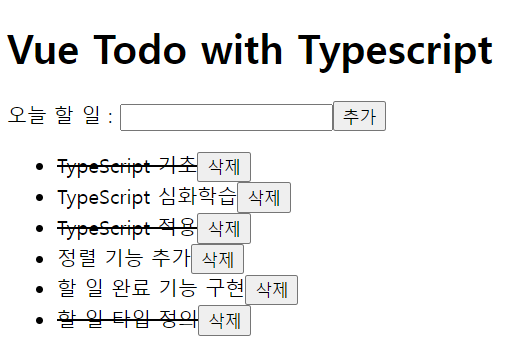

# vue-todo-ts

## 학습한 내용
- 뷰 타입스크립트 프로젝트 기본 구조
- 재활용성을 고려한 공통 컴포넌트 설계 방법
  - 인풋 태그의 한글 입력 처리 방법
- <code>.vue</code> 파일에서의 타입스크립트 정의 방식
  - <code>data</code>
  - <code>methods</code>
  - <code>props</code>
  - <code>computed</code>

## 간단한 TodoApp
- TypeScript 적용 및 이점 학습
- props 타입 정의
- interface 타입 정의
- data 타입 정의
- 최종 화면

# 타입스크립트란?
- 타입스크립트 공식 문서 : https://www.typescriptlang.org/
- 자바스크립트에 타입을 부여한 언어
- 컴파일 : 타입스크립트를 브라우저에서 실행하려면 파일을 한번 변환해주어야 한다.

## 타입스크립트 장점
- 자바스크립트 코드의 품질과 개발 생산성을 높일 수 있다.
1. 에러의 사전 방지
2. 코드 가이드 및 자동 완성(개발 생산성 향상)

## 타입스크립트 프로젝트 시작하는 방법
1. <code>npm i typescript -g</code>
2. <code>tsc index.ts</code>

## 타입스크립트 기본 타입
- Boolean
- Number
- Striong
- Object
- Array
- Tuple
- Enum
- Any
- Void
- Null
- Undefined
- Never

## 함수
- 함수의 파라미터(매개변수) 타입
- 함수의 반환 타입
- 함수의 구조 타입

### 함수의 인자
- 타입스크립트에서는 함수의 인자를 모두 필수 값으로 간주한다.
- 따라서, 함수의 매개변수를 설정하면 <code>undefined</code> 나 <code>null</code> 이라도 인자로 넘겨야하며 컴파일러에서 정의된 매개변수 값이 넘어 왔는지 확인한다.
- 정의된 매개변수 값만 받을 수 있고 추가로 인자를 받을 수 없다.

## 인터페이스
- 인터페이스는 상호 간에 정의한 약속 혹은 규칙을 의미
- 타입스크립트에서의 인터페이스는 보통 다음과 같은 범주에 대해 약속을 정의
    - 객체의 스펙(속성과 속성의 타입)
    - 함수의 파라미터
    - 함수의 스펙(파라미터, 반환 타입 등)
    - 배열과 객체를 접근하는 방식
    - 클래스

## Enums
- 이넘은 특정 값들의 집합을 의미하는 자료형
- 타입스크립트에서는 문자형 이넘과 숫자형 이넘을 지원

## 연산자를 이용한 타입  정의
- Union Type
    - 유니온 타입이란 자바스크립트의 OR 연산자와 같이 A이거나 B이다 라는 의미의 타입이다.
- Intersection Type
    - 인터섹션 타입은 여러 타입을 모두 만족하는 하나의 타입을 의미

## 클래스
- 타입스크립트는 객체의 특정 속성의 접근과 할당에 대해 제어할 수 있다.
- 이를 위해선 해당 객체가 클래스로 생성한 객체여야 한다.
- Abstract Class
    - 추상 클래스는 인터페이스와 비슷한 역할을 하면서도 조금 다른 특징을 가진다.
    - 특정 클래스의 상속 대상이 되는 클래스이며 좀 더 상위 레벨에서 속성, 메서드의 모양을 정의한다.

## 제네릭
- 여러 가지 타입에서 동작하는 컴포넌트를 생성하는데 사용
- 제네릭이란 타입을 마치 함수의 파라미터처럼 사용하는 것

## 타입 별칭
- 타입 별칭은 특정 타입이나 인터페이스를 참조할 수 있는 타입 변수를 의미
- 새로운 타입 값을 하나 생성하는 것이 아니라 정의한 타입에 대해 나중에 쉽게 참고할 수 있게 이름을 부여하는 것과 같다.
- type vs interface
    - 확장 가능 / 불가능 여부
    - 인터페이스는 확장이 가능한데 반해 타입 별칭은 확장이 불가능하다.
    - 가능한 <code>interface</code>로 선언해서 사용하는 것을 추천

### 참고자료
**Copyright © 2020 Captain Pangyo**
